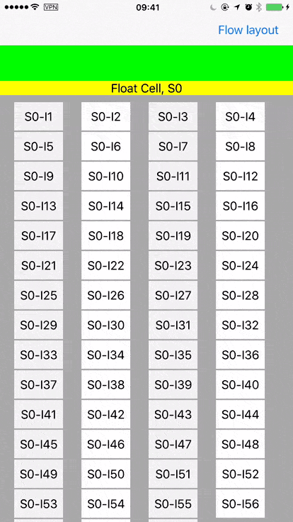

# GWCollectionViewFloatCellLayout


## Summary

Custom layout for a collection view using vertical scrolling with float cell, like UICollectionViewFlowLayout. Written in **Swift**.

## Screenshot



## Use

Just set layout properties when `viewDidLoad`

```swift
	override func viewDidLoad() {
        super.viewDidLoad()
        
		let sectionWidth = UIScreen.main.bounds.width
        self.layout.floatItemSize = CGSize(width: sectionWidth, height: 20)
        self.layout.itemSize = CGSize(width: sectionWidth / 6, height: 40)
        self.layout.headerReferenceSize = CGSize(width: sectionWidth, height: 50)
        self.layout.footerReferenceSize = CGSize(width: sectionWidth, height: 50)

        self.layout.sectionInset = UIEdgeInsets(top: 10, left: 20, bottom: 30, right: 40)
        self.layout.minimumLineSpacing = 2
        self.layout.minimumInteritemSpacing = 4
	}
```


## Thanks

Thanks to  [Brightec blog](http://www.brightec.co.uk/blog/uicollectionview-using-horizontal-and-vertical-scrolling-sticky-rows-and-columns) & [Demo](https://github.com/brightec/CustomCollectionViewLayout)

## Contact

Follow and contact me on [Twitter](https://twitter.com/gewill_org) or [Sina Weibo](http://weibo.com/gewei). If you find an issue, just open a ticket on it. Pull requests are warmly welcome as well.

## License

GWCollectionViewFloatCellLayout is available under the MIT License